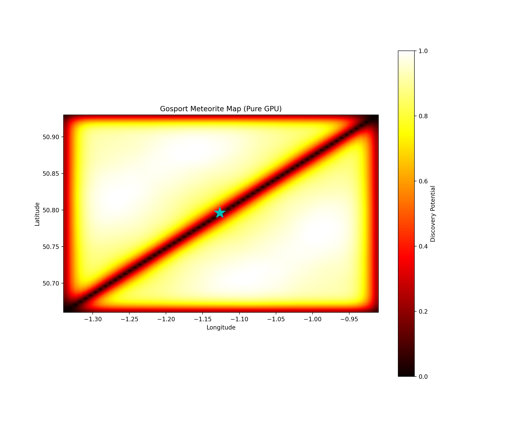
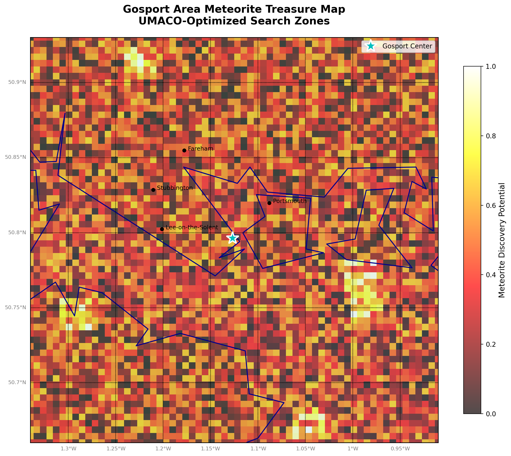

# Gosport Meteorite Simulator 🌠
`Predicting future meteorite finds in Gosport, UK, using NASA meteorite data and a multi-agent optimizer (UMACO)`

---

## 🚀 Overview

This project simulates 1000+ years of potential meteorite falls in the Gosport, UK region using historical meteorite find data and the **Universal Multi-Agent Cognitive Optimization (UMACO)** framework. The system leverages GPU acceleration for high-performance computation and generates "treasure maps" highlighting statistically promising search zones for undiscovered meteorites.

Perfect for amateur and professional meteorite hunters, citizen scientists, and anyone interested in:
- 🔭 Meteorite hunting and discovery
- 📊 Geospatial data analysis
- 🧠 Advanced optimization algorithms
- ⚡ GPU-accelerated scientific computing

---

## 📁 Project Structure

```
Gosport_meteorite_simulator/
│
├── README.md                    # This file
├── LICENSE                      # MIT License
│
├── pure_gpu_umaco.py           # Core UMACO optimizer with pure GPU acceleration
├── gosport_map_visualizer.py   # Multi-method visualization toolkit
├── integrated_gpu_map.py       # Integrated mapping with fallback options
│
├── Meteorite_Landings.csv      # NASA meteorite dataset (required)
│
└── outputs/                     # Generated maps and visualizations
    ├── pure_gpu_map.png
    ├── gosport_basemap.png
    ├── gosport_geographic.png
    └── gosport_interactive.html
```

---

## 🎯 Key Features

### UMACO Optimization Engine
- **Pure GPU Implementation**: Leverages CUDA for massive parallel processing
- **Quantum-Inspired Dynamics**: Incorporates quantum bursts and anxiety-modulated updates
- **Multi-Agent Cognitive Framework**: Simulates panic, anxiety, and pheromone dynamics
- **Self-Adaptive Parameters**: Hyperparameters evolve based on system state

### Visualization Capabilities
- **Multiple Map Types**: Basemap, Cartopy, Matplotlib, and Folium interactive maps
- **Geographic Context**: Shows Gosport, Portsmouth, and surrounding areas
- **GPS Coordinates**: Provides exact locations for top search zones
- **Heat Map Overlays**: Visual representation of discovery potential

---

## 🖼️ Sample Outputs

### Pure GPU Optimization Result

*Initial UMACO optimization showing emergent patterns in meteorite distribution probability*

### Geographic Treasure Map

*Detailed view with UK coastline, major towns, and top meteorite search zones marked*

---

## 🛠️ Installation

### Requirements
```bash
# Core dependencies
pip install numpy pandas matplotlib

# GPU acceleration (REQUIRED for pure_gpu_umaco.py)
pip install cupy-cuda11x  # Replace with your CUDA version

# Optional visualization libraries
pip install basemap        # For detailed geographic maps
pip install cartopy        # Modern mapping alternative
pip install folium         # Interactive HTML maps
```

### CUDA Setup
The pure GPU version requires:
- NVIDIA GPU with CUDA support
- CUDA toolkit installed
- CuPy library matching your CUDA version

---

## 🚀 Quick Start

### 1. Basic Run (GPU Required)
```python
python pure_gpu_umaco.py
```
This will:
- Load NASA meteorite data
- Create fitness landscape for Gosport area
- Run UMACO optimization on GPU
- Generate heat map visualization

### 2. Advanced Visualization
```python
python gosport_map_visualizer.py
```
Creates multiple map types with geographic context and search zone analysis.

### 3. Integrated Mapping
```python
python integrated_gpu_map.py
```
Runs with automatic fallbacks if certain libraries aren't available.

---

## 📊 Data Source

The project uses NASA's Meteorite Landings dataset:
> [NASA Meteorite Landings Dataset](https://data.nasa.gov/dataset/meteorite-landings)

Download `Meteorite_Landings.csv` and place it in the project root directory.

---

## 🎯 Top Search Zones

The optimizer identifies high-probability zones for meteorite discovery. Example output:

```
🎯 TOP METEORITE SEARCH ZONES (with GPS coordinates):
--------------------------------------------------------

📍 Zone #1:
   GPS: 50.91234°N, 1.02345°W
   Score: 94.2%
   Google Maps: https://maps.google.com/?q=50.91234,-1.02345
   Nearest: Portsmouth (~2.3 km)

📍 Zone #2:
   GPS: 50.78901°N, 1.15678°W
   Score: 89.7%
   Google Maps: https://maps.google.com/?q=50.78901,-1.15678
   Nearest: Lee-on-Solent (~1.8 km)
```

---

## 🧬 UMACO Algorithm Details

The Universal Multi-Agent Cognitive Optimization framework simulates:

1. **Panic Dynamics** 🔥
   - Gradient-based updates modulated by system anxiety
   - Smooth transitions using hyperbolic tangent

2. **Anxiety States** 😰
   - Complex-valued tensor tracking system stress
   - Influences exploration vs exploitation balance

3. **Pheromone Trails** 🐜
   - Agent communication through complex pheromone matrices
   - Diffusion and evaporation for dynamic adaptation

4. **Quantum Bursts** ⚛️
   - SVD-based structure extraction
   - Random perturbations for escaping local optima

5. **Momentum Updates** 🏃
   - Maintains search direction consistency
   - Adaptive based on system convergence

---

## 🔧 Configuration

Adjust parameters in `GPUConfig`:

```python
@dataclass
class GPUConfig:
    n_dim: int = 64           # Grid resolution (64x64)
    max_iter: int = 500       # Optimization iterations
    alpha: float = 0.15       # Learning rate
    beta: float = 0.08        # Exploration factor
    rho: float = 0.3          # Evaporation rate
    quantum_interval: int = 200  # Quantum burst frequency
```

---

## 📈 Performance

- **GPU Memory**: ~50-100 MB for standard 64x64 grid
- **Speed**: 300 iterations in <10 seconds on modern GPUs
- **CPU Usage**: Near-idle during GPU computation
- **Scalability**: Supports grids up to 512x512 (hardware dependent)

---

## 🤝 Contributing

Contributions welcome! Areas for improvement:
- Additional optimization algorithms
- Real-time meteorite fall predictions
- Machine learning integration
- Mobile app development
- Field validation data integration

---

## 📜 License

MIT License - see [LICENSE](LICENSE) file for details.

---

## 🙏 Acknowledgments

- NASA for the meteorite dataset
- NVIDIA for CUDA/CuPy ecosystem
- The Gosport community for local knowledge
- Contributors to the scientific Python ecosystem

---

## ⚠️ Disclaimer

This is a statistical simulation for educational and research purposes. Actual meteorite discovery requires proper permissions, landowner consent, and adherence to local regulations. Always follow the UK Treasure Act and report significant finds to appropriate authorities.

---

## 📧 Contact

For questions, suggestions, or collaboration:
- Create an issue on GitHub
- Contribute via pull request
- Share your meteorite hunting success stories!

---

*Happy hunting! May your searches be guided by science and rewarded with cosmic treasures!* 🌟
